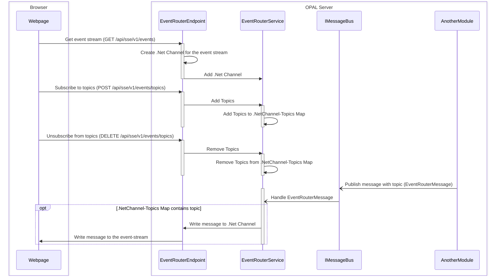

# EventRouterModule

The **EventRouterModule** provides a robust, thread-safe implementation for managing Server-Sent Events (SSE), event-streams and topics. It is designed to facilitate real-time, one-way communication from backend OPAL server to browser, supporting multiple event-streams and topic-based message delivery.

The **Event Router Module** provides common functionality to publish SSE events to the Api application host. It is designed to be used by other modules that require Server-Sent Events (SSE) capabilities.

## Features

- **Event Stream Management:** Dynamically add and remove SSE event-streams.
- **Topic Subscription:** Subscribe or unsubscribe event-streams to specific topics.
- **Message Routing:** Efficiently route messages to all event-streams subscribed to a given topic.
- **Thread-Safe:** Uses concurrent collections for safe multi-threaded operations.
- **Extensible:** Easily integrate with ASP.NET Core endpoints.
- **Wildcard Pattern Matching:** Supports * and # wildcards.
  - Each word can be any empty or non-empty string without *, # and ..
  - *(star) can substitute for exactly one word including empty string.
  - #(hash) can substitute for zero or more words including empty string.

## Key Components

- `IEventRouterService`: Interface defining the contract for SSE event-stream and topic management.
- `EventRouterService`: Concrete implementation of `IEventRouterService`.
- `EventRouterMessage`: Represents a message with a topic and payload.
- `EventRouterModuleEndpoints`: Provides HTTP endpoints for SSE connections.
- `EventRouterModuleRegistration`: Extension methods for registering the module in your application.
- `ITopicMatcherService`: Interface defining the contract for pattern and topic matching.
- `TopicMatcherService`: Concrete implementation of `ITopicMatcherService` using recursion.
- `TopicMatcherServiceRegex`: Concrete implementation of `ITopicMatcherService` using Regular Expressions.

## Usage

### Usage from SSE client

1. **Create Event Stream**:
   Use `GET /api/sse/v1/events` REST API to create the event stream.

2. **Add Topic to the Event Stream**:
   Use `POST /api/sse/v1/events/topics` REST API to add topics to the event stream.

3. **Manage Topics**:  
   Use `DELETE /api/sse/v1/events/topics` REST API to remove topics from the event stream.

### Usage from the modules to publish the Event Router Message

**Broadcast Event Router Message**:  
   Use `IMessageBus.PublishAsync(EventRouterMessage message)` to send a message to all event-streams subscribed to the message's topic.

## Sequence diagram

The following sequence diagram illustrates the interactions between the browser, event router endpoint, event router service, message bus, and other modules when managing event streams and topics, as well as publishing messages.

